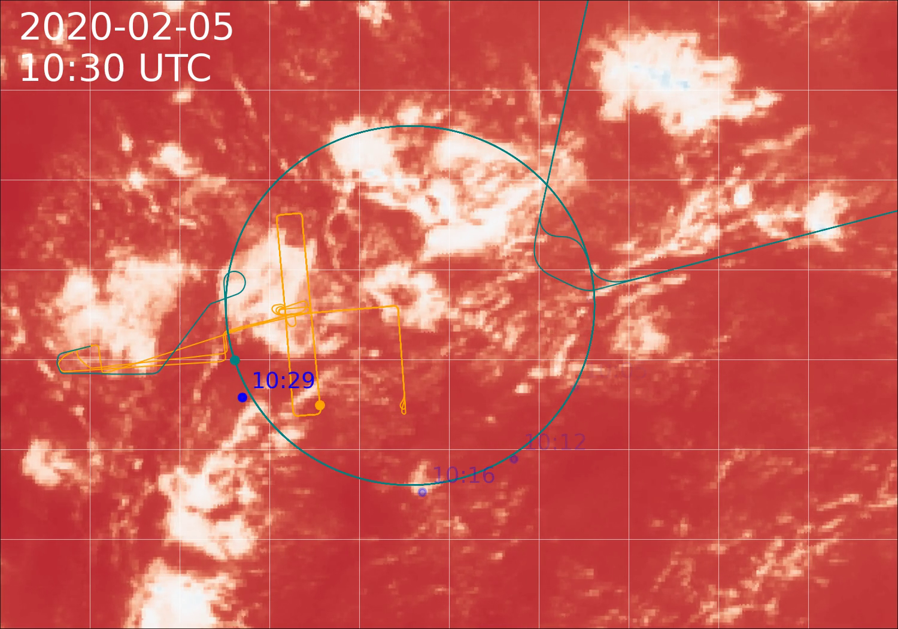

# EUREC4A/ATOMIC flight overview movies
[](https://doi.org/10.5281/zenodo.4777954)

Scripts to generate movies of GOES16 imagery with overlays of flight tracks and soundings.



A first version of the movies with black and white colorscale is also accessible on
[Youtube](https://www.youtube.com/playlist?list=PLiy9_GnmONPH1o5t2JVJhp4G9CxZgtCpc)

## Installation
```
# Install package requirements
pip install -r requirements.txt

# Install requirements of eurec4a-intake
pip install -r https://raw.githubusercontent.com/observingClouds/eurec4a-intake/master/requirements.txt

# Clone directory
git clone https://github.com/bfildier/EUREC4A_movies
```
All necessary data (satellite images, platform tracks, soundings data) is loaded automatically from online resources.
## Creating the images
GOES16 satellite images are created with
```
python ./scripts/make_movie_opendap.py -d 20200205 --start_time 10:00 --stop_time 12:10
```
## Creating the movie
Based on the images created above
```
python scripts/make_movie_opendap.py -d 20200205 --start_time 10:00 --stop_time 12:10
```
overlays the GOES16 images with flight trajectories and sounding trajectories. If the start date and stop date are different, use the --stop_date option.

Note: The images need to be created first and must exists for the requested times

## Configuration
The configuration of the movies/images is done by the config-yaml files in `./config/`

- Output directories and output are defined in `./config/output_user.yaml`
- Selection of channel and colormap depending on day-time can be adapted in `./config/design.yaml` by adding specific time sections:
    ```
    satellite:
      defaults:
        colormap: terrain
      timespecific:
        "00:00-10:59":
          colormap: RdBu_r
          channel: 13
          vmin: 260
          vmax: 302
        "11:00-20:59":
          colormap: RdBu_r
          channel: 2
          vmin: None
          vmax: None
        "21:00-23:59":
          colormap: RdBu_r
          channel: 13
          vmin: 260
          vmax: 302
    ``` 
  If a timestep is not within the specified time ranges, the default values are used.

## Specific use
This code was used to generate movies for appendix of the ATR data paper (2021). These movies can be reproduced using the config/design_ATR.yml file.

